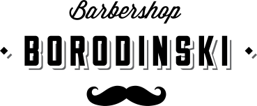

<p align="center">
  
</p>
<p align="center">
	<h3 align="center">Барбершоп Бородинский</h3>
</p>

<!-- Used for the "back to top" links within the document -->
<div id="contents"></div>

# Содержание

- [Вступление](#вступление)
- [Ссылки](#ссылки)
- [Зависимости](#зависимости)
- [Начало работы с проектом](#начало-работы-с-проектом)
- [Команды](#команды)
- [Структура проекта](#структура-проекта)
- [Использованные технологии](#использованные-технологии)
- [Лицензия](#лицензия)
- [Автор](#автор)

## Вступление

Проект «Барбершоп» был выполнен в рамках пройденного онлайн‑курса «Продвинутый HTML и CSS» от HTML Academy.

За основу проекта был взят мой личный [boilerplate](https://github.com/RedEagleAP/light-boilerplate/). Для более детального ознакомления с инфраструктурой проекта тыкайте [сюда](https://github.com/RedEagleAP/light-boilerplate/#readme).

## Ссылки

<table>
  <tr>
    <th><a href="http://redeagleap.github.io/barbershop/dist/index.html">Главная страница Desktop</a></th>
    <th><a href="http://redeagleap.github.io/barbershop/dist/form.html">Страница с формой Desktop</a></th>
    <th><a href="http://redeagleap.github.io/barbershop/dist/photo.html">Страница с фотографиями Desktop</a></th>
  </tr>
  <tr valign="top">
    <td>
      <a href="https://lh3.googleusercontent.com/kj4CFarI1HKyPalSKNtPi5PX5B2_-AbhTtvtJ1HHbX-hApsIgsSfReeH85XDkZXMre3wbxnGqZdVOd1yIV-0kXsT8cLQfmvkv9YhmHwXBOX-cD9t28qCH0zlxhK4n_slyDB1MHR8kfp8qOqs-E8ADY_WKbYizPunhnCdTMg8fyynzY3fW2WFXKqDOLGM77c5n6D2ZU4u-JxcqGEgTxtiBevrJrWa7Sj9l23C_uC_CyXdhNU4_qQRnXzdmZU9FQ_0hR2200rsPCZBhSuFl_Wsu25kVu1Kk25heFeELYZYRR5VyIUcOWV9CmavOPZFqkNw_Ei9GeHPfhQeOpRI1C39NUePVbW0uaEini1UE76YAcX5YybjQbc202TRniB0CDVj7GGnBUxDjMBQFvrFGMMqAQn5gU9mpNbzTnxMO6c6ZGG7_vDxuisDt-sceYG6AbKw8ioyGhm3RuS8rgCloECGtGFej8ytLTNfY87MUEkM5RCQOjcoIrwRdiETrs2YR8hd1aRdheaV_QOqqxmXFvGn81qIuJHSZImZPiYLeepcL3KsUJm0WsRkuCZ83MJbTAdQjSg5ZPUoC3AuH2TNR0fa2EC418z10tuVdIZt5MDAr2EOvcbvH_ZNkHLJoFf7NFzcgJrGr8bxpQCDI9laJBUdeU1EPlbr4so=w517-h953-no" target="_blank">
        
      </a>
    </td>
    <td>
      <a href="https://lh3.googleusercontent.com/Dki7Gb1bhlyK_wEf_eZFuKL7toWRZNBh_jExvNGi4pyeVztNDCVoR7awO-fgLB3G-eQkTUe6JDcBE34RVEEBGkJtAx3WpIVoiZI9VGBsgnHraJiVFGq_eLpTab_cqqGYYcyBEw45uh6wbHnDbECksndQa9sWNXc2y5Ispav84Df2O9nTVqUwOYTA1kUMOVPM2lxTZ1vrOzx_Vx8e0pHatzHLvuVyCCdbHkbYvgHP3dLtm5Yoe4L7Bs0bWT1KgFT4BSGtUEydtZQWDb504gvQyZhM0_0L09rpQfmcZJ5rkYoQyaLfyzEQZbPQY48TSgK99nVNG7T43dVNDmoPLcwuqrU_YKhp2uXIwznR5PJ587RBaH6MqPL3fHNA8738t9G_jySJ9TmSARoynnGWmycdhBxSe_qejzZqJta8deRU-kdH_szUXkRlrDSaz9X29pfDsqT3Zj8Sxoca8zYlhPteKfHcZn2NUeyTzol0Uv0BSMMK8b0JPF2HWmdVO9N23XA489nqHOkpxYrKItbuPXQv4j2m0aczkSVrjrQGTB4AOyiRH_5xE0-XJvC5_LRkS-UTeDFqZ0QDLo77eY1oMw8cMawbRuHe_jewgy2hXIlNcPaZPolvRgW5hKBBMDIRYEqt4nh-XcqIrcijvu4qFqa_mSHUOa7uV9w=w553-h953-no" target="_blank">
        
      </a>
    </td>
    <td>
      <a href="https://lh3.googleusercontent.com/ITePWf4aiHBvAp0lYfR3u_xotP193LFNcxLfN8-juUit5YHZezKzB_Vgr01sSm9F6hSZqYKQ0iZj3MSEG2iFbZLXGEORMoXYkhimOKSD5o9WQ80htCZ1CbRETsPeZLBOFTNOM6H608tZx19jvyz_cJGMfnLhcwVGSuZDiZ7EKNUcos-JVNyARsnjmT7ElrIrPg1FgdIYqWFRCRH3_hQyIViND-ffv1CkzigLQDYEOWbliNweIG9-N1b3MmRUw4gRC8KdXo5A-ap7Ap4wgQanVZwIAmrhz4EnqD6L9t4DBYt7TWyCodOuMflVduvu7Zml1Wo_YKQyb5rIyhnNgXBLA8K7qYMNoloJejlJwFbdQw_k80cNbUHj1ZwByprl7wqUbPTr2kSEahm0GeqCowmG0qyYvWFXvjTo-C1TwnjAs9gxzMBFYHfuDbMqEznOrjCeuOMSHCAwrDLI0xIX7vX87bCmsiNbCfs2sho9uW48HLOYBaenpk7_2DszAA9Yu1khqTwXf5L2UCon-GMsPUwJwycPBHsFZ0RArsr3L2QE0TLEzJS3qdsVNwVbVg9_3_axPMYIcAW538AUES8vcRp_W55Dn_LVoxcn7HfxpoyOMmEDbLD3kGxcfXn61qsBeQEoG1WwIGWOWjwTyhs8Qx-06xwUvzjGjP4=w470-h953-no" target="_blank">
        
      </a>
    </td>
  </tr>
</table>

<table>
  <tr>
    <th><a href="http://redeagleap.github.io/barbershop/dist/index.html">Главная страница Tablet</a></th>
    <th><a href="http://redeagleap.github.io/barbershop/dist/form.html">Страница с формой Tablet</a></th>
    <th><a href="http://redeagleap.github.io/barbershop/dist/photo.html">Страница с фотографиями Tablet</a></th>
  </tr>
  <tr valign="top">
    <td>
      <a href="https://lh3.googleusercontent.com/70rvrTdSCytZMk5hT2-YsccnKfwi3PbscQWADeHHw5Mj8Nw7O4Dou4mT-4M09z-9FyicCrhFQe3mD4RaSJPpIZAh8s-pEU1mtszmHlx0Miv8Ck0nq-w7KCWZWyOxU-Wk3i2jdsTEzklMzQmRJIpjlNE4UMFKziMjOv9Wdv7mfRdnO5-u1e1SnDY1Kq20yFiH985jzFNcY9TvymvLM3Fzg8hkMtdYwAf5i3KrzrmAxd-TPx1YsALnTQTIHIfjKOz-6RdJzxTMwT_pBVhTPfzpWFB8jk_IJs6XB_oSop1b9XYmKsX4fg4PNXfZycpIXeCXRusnYtcf-uFZj49f94RIgi9tZIhOD7UQ25m39NLX_8Dk0foPV2O34l8Deosqow2iKJgfIEP1o4YjwsO1p_xn4Z1Gs8jWkDvd_WjhfAhV1ltPrkJTF86S9Oa6v3nUG-nOs4ipnvx1sctq4LsPFFLVBmsaUclB2UROE8u8EUy_zcdXMjkHYbgehM4GxepSLoL0lfk0yV5hQ1Ej6Pcg6W8MbdDA_HKWRktBCCCwm53SC9pOY5mxO9yQM1cGSLyDO3bCLecAgfd1cppffzRAW2e8iHXQ6tSj05hB8MYHmLJhbSXal8gq0L1VKeEzgaQdK8NTQOn56dCUotJxYCvlHgs5-MP9ySHo7Hg=w312-h953-no" target="_blank">
        
      </a>
    </td>
    <td>
      <a href="https://lh3.googleusercontent.com/KmHC-VyZQf9IoNs1AY7tV-g0twG9Y_iJ-GvNb0mNZa0zdsG7kJrDycHDKS4NrMITe_zzQ9Xx5WkZ8qQr_vJNd3xZd8T2luI6QBreEe4NODZFDbMy8MCUAmkVyZXOXCV2rcdZtWUgm-502FtfcBulcFpGC1DwnzVMZinpfVOYOAH-4Oe-_6C-UABHHQr1UetGjyAT5-lgkfYfdqLDK4B_mTw2oppaWvFIBzHdN04ZqGiJRfDIThuOWKNaDkJJsfptCP7Z1KKekWI6ITJeSFqQSXr8U0o3qIQ1HJX8O10bn9ILwUswXurT1u1P-0ZaSKFIucduOCHL5Or8fgM1u425ZW-YEQwwauTH5Xev5W1KFq26LTrZgJsYe_J4wiX22_jVOxXmT0wvJJR5J2cOoEbu97fF2YnNQOfLVUNm223jwAXUYR-soeunQkhbKthtvO9Nh6271MwLdcSGXQSLWX98-tIne8cQyT7wDSF6iaZNWDztwxi2XsNbeLsFvR-oMAW8OaRM0T0ocFTkOl8VicU-0jVqdBPVvCd--jS1Qq9QeH4OiCgDEYQAUWGJsvc7kca9AS7NNdi2lqRRiTZHfohvSVkXa36A0ndVVwzKaQ9SfKDZzTcVess98RT4D-MG0RMGnts7iLkeTSnOYfbCOuN2Xvw9HbWscuI=w324-h953-no" target="_blank">
        
      </a>
    </td>
    <td>
      <a href="https://lh3.googleusercontent.com/G1gNi5rWGv57XWJ6FGcyXuj41LP9vQ3up2n8F4V4mCmO-t38PdO7rg0N-QTplD2LXUfPs1l2xcm15gbIFHm8a69Xf9OiHxlWzxseoGanG2vEvNwZ9i1Ym6Uo_dyLqEe-7vGNEopIqO1T4ChtxDunz8pqEkuC0P-Xz5qenAam74bLZEyCcni0rruR4r4SM2OxF1CcjCmJZlH0qavljR6gvcNY01u2aCGQN5Ad9JOmKyMNv2-ZXngDyAZtQZiMcEULhe_bUAkzhkRgf3eMHOagVOnwdUYd-otTSzE91qtWyFGtp-5j-c9QrCfV2p2i8LDhJDY7mEnelZantYbydBU54RPjEoo0YrZvw-j0bUH84f-1ZBJF-Yxg77XGs1MmE257yJYMEV5lOlKNeoLD6tskVo7saimhtxZMNub2E3mluXkEpQOsEABX2pYcfDiUftIx8ve1rS8TycygUDhSleC_ZqvAk_0ZkxPMWneQKNE2XN_NRdDr6QxJYMMRPLUjpnD52bdavIK2cnEW_CLE5_p5_2vvzGAVMSF_Z5bGtCZoeAgtWp2kikDdB7xErR8OLrQFe8Ts1Tvm6h2db-OZYAwVpAsqtaEBK6XPy13pq2JS6U6Ho1E1-_qnzKp6XPvH40q4O_vo-HbOF6_3knRc2mpifxn7JSZXw0A=w249-h953-no" target="_blank">
        
      </a>
    </td>
  </tr>
</table>

<table>
  <tr>
    <th><a href="http://redeagleap.github.io/barbershop/dist/index.html">Главная страница Mobile</a></th>
    <th><a href="http://redeagleap.github.io/barbershop/dist/form.html">Страница с формой Mobile</a></th>
    <th><a href="http://redeagleap.github.io/barbershop/dist/photo.html">Страница с фотографиями Mobile</a></th>
  </tr>
  <tr valign="top">
    <td>
      <a href="https://lh3.googleusercontent.com/U-kNq8dd0s5TJAhliQdLCdzpQAxy4SmCdM2H6jTC6JLSHxMb7wCY5lJFXlQouBiv6FA5qsKXWbPgQYk48_OgG46TVJ3wWmP3FMLb4CX2MxtvfQYT80jV1fFnfqaR7spEyIgoALZbXsiSqE8AJN2bpPi-gPlM3Us05e3rivfF16F3mbnIV_I2tLtz3G5tVxWOFZTpLv8QUgZPVCA6QU0riphYfehRrWuqbif2VAQJe_W8cJIi5R1aUin898k3e1vTq_W_mwgg6f1E7XJ_VZySYwD8Hku6yQ7A-75uyDFqVsPQZ1Jr6J-xyWarV15s7LpP5MT5xc0n7hI3uKfjBsdDJuCBis2fxyXHeW_7Wt1BAT2hZI0jp9qaEDQkYBsnL4itgAsgNBMCrK_MxvGD8FhWb3DpI7Q6DQdgfxcSjDT23TWEtimRpriaSoCiUyfsyAOEycglL3NNIPRX3BOOD6-a5-KUtsDAI2bPbAIDWukQf9VtTqfjETjyUH8dqr964Imzy8t7fY-X1AHHP16FKysxjm5fdHUuj6ZH6HQEkayEO6JhHztpllSjFiHaf1ybZft8mJipe0pTiC0wDgWgC9voxA8NPFeWYvma06K24kmjw-pKdnDcml_JoivUs1R2crMw-G12P6gqmnH3yMmdj74dDRd_uGJC6-o=w132-h953-no" target="_blank">
        
      </a>
    </td>
    <td>
      <a href="https://lh3.googleusercontent.com/XKtTDvtWbFl9u5v2MId93MhxceDkgwhpbosawrEcRLpYIA2VTnDXp_OscUpaEC3g3hTDq9uNlcSQLpn4C485YscIkoj3E5xFu8vroxESXfkMYuTlugWt_j347Gly7apT77aUB4D_BszXTVCvxBVKq_6b_7qqcVQHpz-XMBh8lyN-P-ftwrW4325SRdHmo4bzJWnOR81XBu_squpG-Pr7Ydzfs3vuqyW-1A-M6jTuEMmSjcSSXaBZkNNZ93TBvnLvs5UnRZN2-O8jDCS4a4sWFXRqMvVEaLX92mnqtKE9p_1I6NGjBcBTJAN-IWQI_zxKXSq4ZmK4DUBqyycLdpxDsMYI3sNNo1251r58Bk4s8cHBJqUjTHkP8Kgdj55tmuSub7fgw5RJ8J1JPf5I9i5wMnEeV6AR0ecqN9tUgHHPPOKathmpaByZEJMZ-q9CaaHBH6NbPmP-VbZ0oRBGNPApljM6F7XxsnH5V2DnXil7ldy_9sOX8PJZKq2b5YT7hgQqsljQFOUAUJDLu0TD814p8iPp3H-hcW7l-5ZCyc84dmUqn8OH6Ie0LpklWx5N5bm7yMuYTHgp3p3xp9XEBjqZg4z8Iyrt6bTJF6J3gOGoAiWm7UPyhENqfvcmnbfBln68d2kD4JL32_3LlAPKcCl0ThaHbqtmFGg=w138-h953-no" target="_blank">
        
      </a>
    </td>
    <td>
      <a href="https://lh3.googleusercontent.com/FTo-0aHA5wOEmCYLZJ1VNqqMZ5B8YB4XXlQ2KsXktnDdHy7Z1eNTD7Vi47T6z1rTyomF1v7FVMXdhO6elAdDq4UgjcOkI34WhFIOuZlWMDXN7O2hCDyyFKvtj82ZQxo8ftfOmdWnMkBspeoTf6rUBweVmIlRONaO2LQQ4cxfVpXEaT3-O14e-cEbuB6K8jvY923m_6E8N2Febi5IbQ6_4okM3TeLFIg66d69TPy9rFrjzvQiAraHsvnmCrSp4o4Fa9DSwo0RDNjwvFsCzriYbLQw3vkrQTtJi76Ye5D0ELNpycv5THX-Hb_v9ue4M9vLl8zJu2VvbLR_1LLC_My-e2fy6U1fxxA1xbt7_HYSOzrx7C9Deg2sHEN3lPQHTvzaLeOlN9tJEhyCSl9LLJ-HVveHwdbhUqnxye5UC1ieJ9H9bwc2HLVLFMR7XCa_2ZEQr-5j6RrMViRxsX4ghj3v-HUPnIPS5Kl51gD6JM8q8BN5RMT5EFRlQHNmERrmDMgTlxqHqEJkG74xqpnY4mata4by2Hi7bvwQ6X54PD8k_PAWr36xZ2IEBf18r0uMWSOGWQJ2yKCHMQ5H5WQdEH_ESXGbxBvu9bXHpfR8hFfLlcOnlyIGruM6-BW0y9-H9-YfTpCimO4yciM5hhRCBQ3CLLeJ9H95Qz8=w95-h953-no" target="_blank">
        
      </a>
    </td>
  </tr>
</table>

<sub>[⇧ back to top](#contents)</sub>

## Зависимости

- [Node.js](https://nodejs.org/en/)
- [NPM](https://www.npmjs.com/) или [YARN](https://yarnpkg.com/lang/en/)

<sub>[⇧ back to top](#contents)</sub>

## Начало работы с проектом

### Клонируйте репозиторий:

Клонируйте репозиторий, чтобы получить все исходные файлы доступные на Github:

```bash
$ git clone https://github.com/redeagleap/barbershop.git

$ cd barbershop/
```

А затем установите NPM-модули через:

```bash
#Ностальжи
npm install

#Хипстер
yarn
```

Это установит необходимую папку __node_modules__.

<sub>[⇧ back to top](#contents)</sub>

## Команды

 _С Webpack вы можете использовать следующие NPM Script команды_

| Действие                                                                                  | Npm                  | Yarn              |
|-------------------------------------------------------------------------------------------|----------------------|-------------------|
| Инициализация проекта и документации Sass(/sassdocs/)                                     | `npm run init`       | `yarn run init`   |
| Основная команда для разработки с BrowserSync и Webpack                                   | `npm run dev`        | `yarn dev`        |
| Сжимает JS, Images, CSS. Предназначен для автоматизированной сборки, после Gulp Init.     | `npm run build`      | `yarn build`      |
| Перестройте все файлы JS, за исключением файла приложения JS.                             | `npm run scripts`    | `yarn scripts`    |
| Перестройте все файлы изображений для CSS, создайте растровые и векторные спрайты.        | `npm run uiimages`   | `yarn uiimages`   |
| Скопируйте все файлы изображений для Documentusage.                                       | `npm run htmlassets` | `yarn htmlassets` |
| Сгенерируйте Favicons и фрагмент HTML(сгенерированные файлы вы найдете в `src/ .system/`) | `npm run favicon`    | `yarn favicon`    |

<sub>[⇧ back to top](#contents)</sub>

## Структура проекта

Папка `dist/` создается после инициализации (`npm run init`) проекта. Все скомпилированные и скопированные файлы папок `src/` находятся там.

**SRC Folderstructure:**

```
src/
├── .system/                          => Internal System Files
├── fonts/                            => Font Files
├── framework/                        => Sass Framework
├── images/                           => All Images
|   ├── bitmapSingle-assets           => Single Bitmap Images
|   ├── bitmapSprite-assets           => Images for Bitmap Sprites
|   ├── htmlimages                    => Content Images (``)
|   ├── vectorSingle-assets           => Single Vector Images
|   └── vectorSprite-assets           => Vector Images for Vector Sprites
├── js/                               => JS Files (e.g. main.js)
├── scripts/                          => Script files that are not installed
├── structure/                        => Source Files for Copy (e.g. Template Files for a WP Theme)
└── style/                            => Styling Source Files
```

**Dist Folderstructure:**

```
dist/
├── assets/                 => All Assets
|   ├── css/                => CSS Files
|   ├── fonts/              => Font Directory
|   ├── js/                 => Javascript Files
|   └── img/                => Background Image Assets
|       ├── system/         => Images like Favicons
|       ├── bitmaps/        => Bitmap Images
|       └── svgfiles/       => Vector Images
└── images/                 => Content Images
```

<sub>[⇧ back to top](#contents)</sub>

## Использованные технологии

**Скрипты**

- [ES2017](https://medium.com/komenco/what-to-expect-from-javascript-es2017-the-async-edition-618e28819711) - поддержка через компилятор [Babel](https://babeljs.io/).

- [Node](https://nodejs.org/) - это кросс-платформенная среда выполнения JavaScript с открытым исходным кодом, которая выполняет код JavaScript вне браузера.

**Стили**

- [Sass](https://sass-lang.com/) - является самым зрелым, стабильным и мощным языком расширения CSS профессионального уровня в мире.

- [Sassdoc](http://sassdoc.com/) - это система документации для создания красивых и мощных документов в мгновение ока.

- [PostCSS](https://postcss.org/) - это инструмент для преобразования CSS с помощью JavaScript

- [Critical](https://github.com/addyosmani/critical) - извлекает CSS наиболее важный, для как можно более скорого отображения начального экрана сайта.

**Автоматизация**

- [Gulp](https://gulpjs.com/) - представляет собой инструментарий для автоматизации болезненных или трудоемких задач в процессе разработки.

- [Webpack](https://webpack.js.org/) - это пакет для JavaScript модулей.

**Оптимизация**

- [Imagemin](https://github.com/imagemin/imagemin) - минимизирует изображения в формате PNG, JPEG, JPG, GIF и SVG.

- [Uglify](https://github.com/mishoo/UglifyJS2) - инструментарий синтаксического анализатора, минификатора, компрессора и улучшения JavaScript.

**Сервер**

- [BrowserSync](http://www.browsersync.io/) - синхронизированное тестирование в браузере.

**Проверка синтаксиса**

- [ESlint](http://eslint.org/) - линтер для JavaScript.

- [HTMLHint](https://htmlhint.io/) - инструмент анализа статического кода для HTML.

- [Stylelint](https://stylelint.io/) - это мощный, современный линтер, который помогает избежать ошибок и применять соглашения в стилях.

- [Prettier](https://prettier.io/) - для форматирования кода.

**Управление кодом**

- [Editorconfig](http://editorconfig.org/) - помогает разработчикам определять и поддерживать согласованные стили кодирования между различными редакторами и IDE.

- [Git](https://git-scm.com/) - является распределенной системой контроля версий, предназначенной для обработки всего, от небольших до очень больших проектов.

<sub>[⇧ back to top](#contents)</sub>

## Лицензия

Этот проект лицензирован по лицензии MIT - подробности см. В файле [LICENSE](LICENSE).

[](LICENSE)

<sub>[⇧ back to top](#contents)</sub>

## Автор

```txt
Глейси сделано с любовью.
---------------------------------------
Автор : Александр Присяжнюк

Почта : insightinyourmind@gmail.com

Github : https://github.com/redeagleap/barbershop.git
```

[](https://forthebadge.com)

<sub>[⇧ back to top](#contents)</sub>
